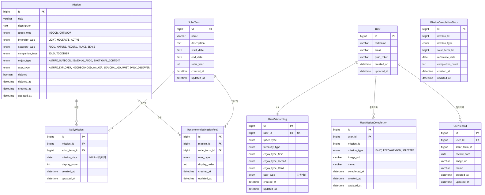
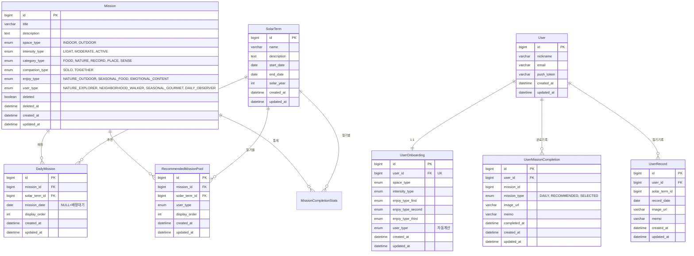

# PeekTime ERD

## 전체 ERD



<details>
<summary>Mermaid 코드 (GitHub 렌더링용)</summary>



</details>

---

## 모듈별 테이블

### peektime-admin (미션 관리)

| 테이블 | 설명 |
|--------|------|
| `Mission` | 미션 풀 (모든 미션의 원본) |
| `SolarTerm` | 24절기 정보 |
| `DailyMission` | 오늘의 미션 배정 (절기 + 날짜) |
| `RecommendedMissionPool` | 추천 미션 배정 (절기 + 사용자타입) |
| `MissionCompletionStats` | 미션 완료 통계 |

### peektime-api (사용자 서비스)

| 테이블 | 설명 |
|--------|------|
| `User` | 사용자 기본 정보 |
| `UserOnboarding` | 온보딩 답변 (1:1) |
| `UserMissionCompletion` | 미션 완료 기록 |
| `UserRecord` | 절기별 사용자 기록 |

> `MissionCompletionStats`는 peektime-admin DB에만 존재하며, peektime-api는 admin HTTP API를 호출하여 조회합니다.

---

## 테이블 관계

### 강한 결합 (FK)
- `DailyMission` → `Mission`, `SolarTerm`
- `RecommendedMissionPool` → `Mission`, `SolarTerm`
- `UserOnboarding` → `User` (1:1)
- `UserMissionCompletion` → `User`
- `UserRecord` → `User`

### 약한 결합 (ID만 저장)
- `UserMissionCompletion.mission_id` → Mission (모듈 분리)
- `UserRecord.solar_term_id` → SolarTerm (모듈 분리)

### 모듈 간 API 호출
- `peektime-api` → `peektime-admin` HTTP API 호출로 `MissionCompletionStats` 조회

---

## Enum 타입

### SpaceType (공간)
| 값 | 설명 |
|----|------|
| `INDOOR` | 실내 |
| `OUTDOOR` | 실외 |

### IntensityType (강도)
| 값 | 설명 |
|----|------|
| `LIGHT` | 가벼운 (5분 이내) |
| `MODERATE` | 보통 (30분 이내) |
| `ACTIVE` | 적극적 (1시간+) |

### CategoryType (카테고리)
| 값 | 설명 |
|----|------|
| `FOOD` | 음식 |
| `NATURE` | 자연 |
| `RECORD` | 기록 |
| `PLACE` | 장소 |
| `SENSE` | 감각 |

### CompanionType (동반)
| 값 | 설명 |
|----|------|
| `SOLO` | 혼자 |
| `TOGETHER` | 같이 |

### EnjoyType (즐김 방식)
| 값 | 설명 |
|----|------|
| `NATURE_OUTDOOR` | 자연/야외 활동 |
| `SEASONAL_FOOD` | 제철 음식/요리 |
| `EMOTIONAL_CONTENT` | 감성 콘텐츠/문화 |

### UserType (사용자 타입)
| 값 | 공간 | 강도 | 설명 |
|----|------|------|------|
| `NATURE_EXPLORER` | 밖 | 적극적 | 자연 탐험가 |
| `NEIGHBORHOOD_WALKER` | 밖 | 가벼운 | 동네 산책러 |
| `SEASONAL_GOURMET` | 실내 | 적극적 | 제철 미식가 |
| `DAILY_OBSERVER` | 실내 | 가벼운 | 일상 관찰자 |

### MissionType (미션 제공 방식)
| 값 | 설명 |
|----|------|
| `DAILY` | 오늘의 미션 |
| `RECOMMENDED` | 추천 미션 |
| `SELECTED` | 선택 미션 |

---

## 선택 미션 로직

선택 미션은 별도 테이블이 아닌 **쿼리 필터링**으로 처리:

```sql
SELECT * FROM mission m
WHERE m.id NOT IN (
    SELECT dm.mission_id FROM daily_mission dm
    WHERE dm.solar_term_id = :currentSolarTermId
)
AND m.id NOT IN (
    SELECT rmp.mission_id FROM recommended_mission_pool rmp
    WHERE rmp.solar_term_id = :currentSolarTermId
    AND rmp.user_type = :userType
)
AND m.space_type = :filterSpace
AND m.intensity_type = :filterIntensity
-- 추가 필터 조건...
```