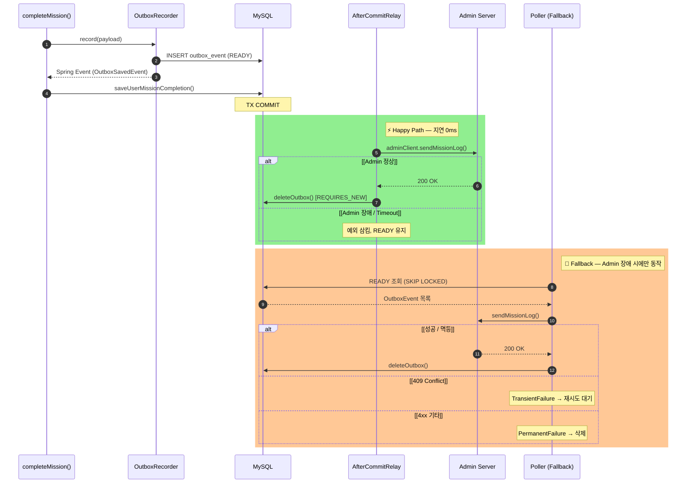
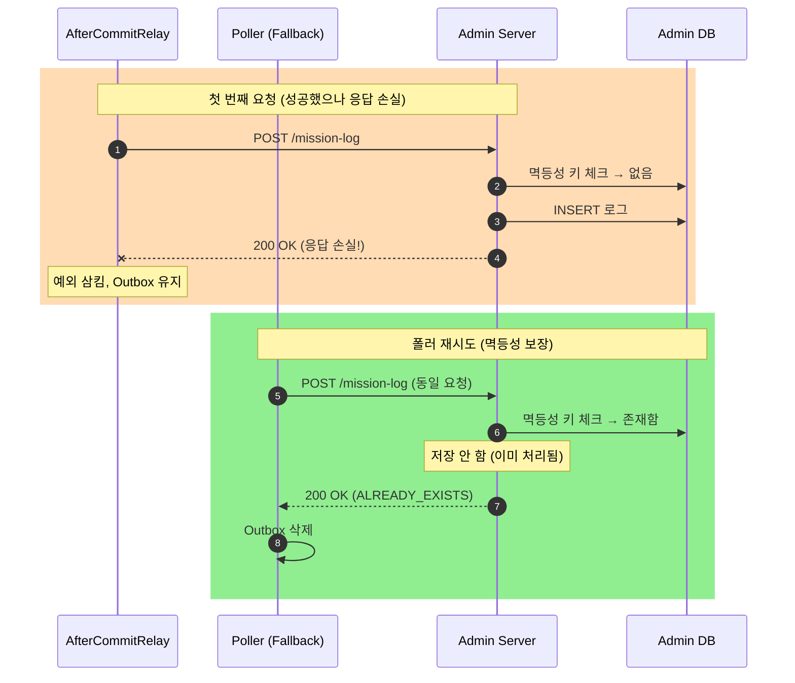
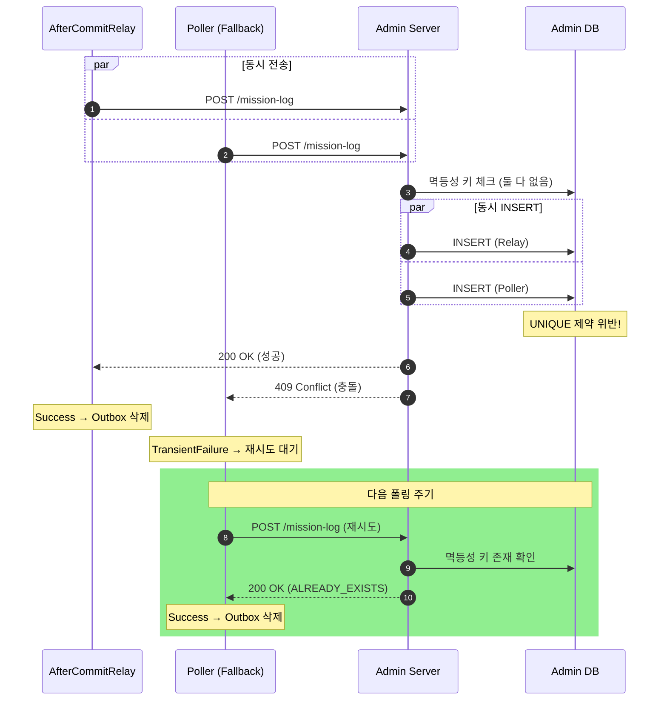
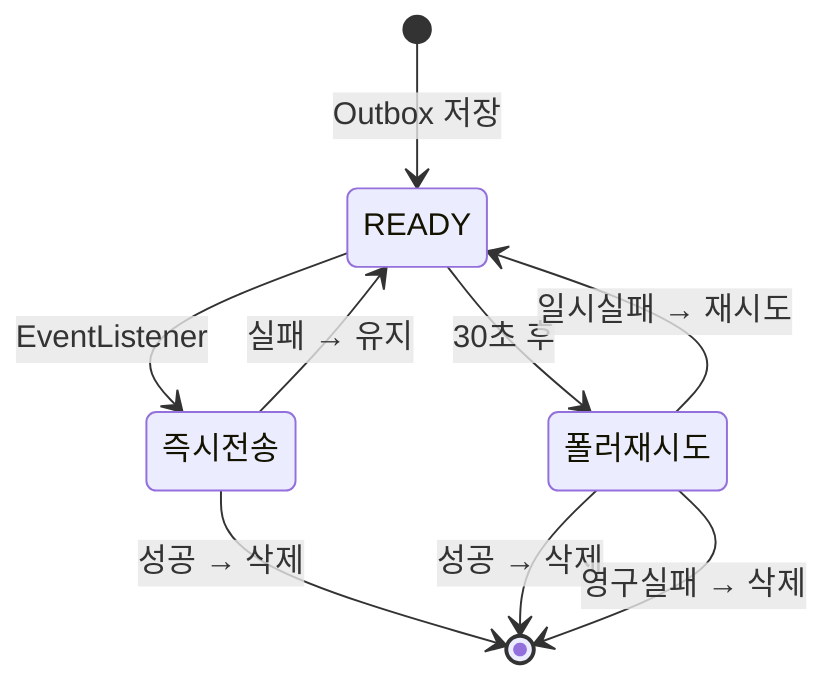
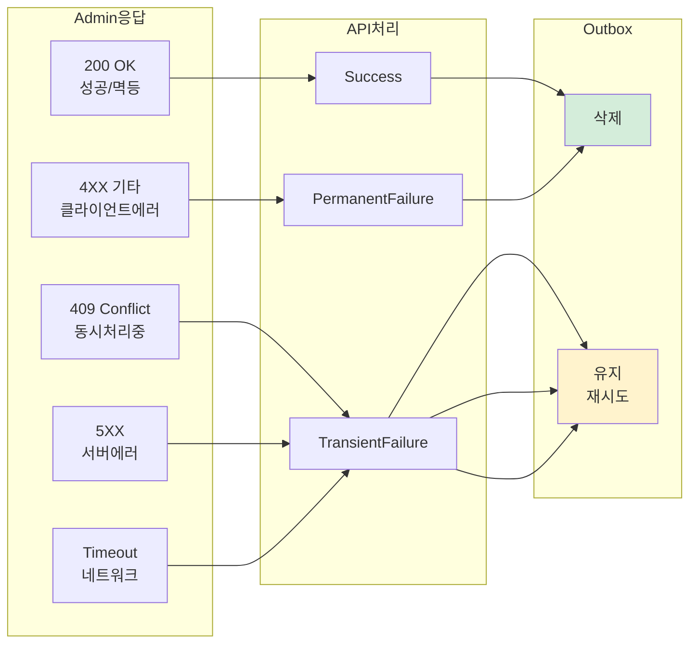

# Outbox 패턴 전체 플로우

## 개요

미션 완료 시 API DB에 기록을 저장하고, Admin 서버에 통계용 로그를 전송하는 전체 흐름입니다.
트랜잭션 아웃박스 패턴을 사용하여 데이터 정합성을 보장합니다.

---

## 전체 플로우 (비동기 + 폴링)



---

## 멱등성 처리 플로우



---

## 동시 요청 처리 (Race Condition)



---

## 전체 아키텍처

```mermaid
flowchart TB
    subgraph Client
        APP[Mobile App]
    end

    subgraph API["API Server"]
        CTRL[Controller]
        SVC[Service]
        REPO[Repository]
        LISTENER[EventListener<br/>@Async]
        POLLER[OutboxPoller<br/>@Scheduled 30s]
        CLIENT[AdminClient]
    end

    subgraph APIDB["API Database"]
        COMPLETION[(UserMissionCompletion)]
        OUTBOX[(OutboxEvent)]
    end

    subgraph Admin["Admin Server"]
        STATS[StatsService]
    end

    subgraph AdminDB["Admin Database"]
        LOG[(UserMissionLog<br/>+ idempotency_key)]
    end

    APP -->|1. POST /complete| CTRL
    CTRL --> SVC

    SVC -->|2. 트랜잭션| REPO
    REPO -->|저장| COMPLETION
    REPO -->|저장| OUTBOX

    SVC -.->|3. 이벤트 발행| LISTENER
    LISTENER -->|4. 즉시 전송| CLIENT

    POLLER -->|5. 주기적 조회| OUTBOX
    POLLER -->|6. 재시도| CLIENT

    CLIENT -->|HTTP| STATS
    STATS -->|저장| LOG

    style OUTBOX fill:#fff3cd
    style LOG fill:#d4edda
```

---

## 6. 상태 흐름



---

## 7. 응답 코드별 처리



---

## 요약

| 단계 | 설명 | 동기/비동기 |
|-----|------|-----------|
| 1. 미션 완료 저장 | UserMissionCompletion + OutboxEvent | 동기 (트랜잭션) |
| 2. 즉시 전송 | EventListener → Admin | 비동기 (@Async) |
| 3. 폴러 재시도 | 30초마다 READY 상태 조회 | 비동기 (@Scheduled) |
| 4. 멱등성 처리 | Admin에서 중복 요청 무시 | - |

### 핵심 보장

- **원자성**: 미션 완료 + Outbox 저장이 하나의 트랜잭션
- **최소 1회 전송 (At-Least-Once)**: 실패 시 폴러가 재시도
- **중복 방지**: Admin의 멱등성 키로 중복 저장 차단
- **사용자 경험**: 비동기 처리로 응답 지연 없음
